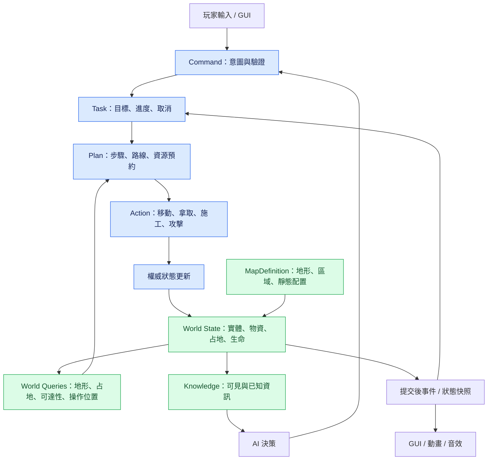

# Jurassic Park：RTS 執行管線與地圖基礎設施設計

設計草案，2026-09-16；席位／所有權／分派／後端決策 2026-09-17 定案。本文是重新規劃的入口，不是已實作功能清單，也不是原版機制的逐項復刻。

# 前言

> [!NOTE]
> 建議閱讀順序：
> 1. ***[本文件：基礎設施設計](./INFRASTRUCTURE_PLAN.md)***：決策狀態、系統邊界、主流程與施工順序。
> 2. [原始提案](./PROPOSAL.md)：課程背景、題材與舊玩法參考，不約束新設計。
> 3. [美術方向](./ART_DIRECTION.md)：既有視覺探索，與遊戲規則分開評估。
> 4. [README](../README.md)：目前原型的啟動與操作方式，不代表重新設計後的操作。



> [!IMPORTANT]
> 遊戲有兩個互相配合的基礎：Execution Infrastructure 回答「事情如何被要求與執行」；World Infrastructure 回答「世界有哪些東西、位於何處、能否接近與改變」。
> 地圖不是等主流程完成後才加入的美術背景，但也不必先完成整套地圖編輯器。地圖設計以原版 6.3 為基準，先用其典型營地與相鄰區域的功能原型提供空間能力，兩者一起形成第一個可玩的切片；這不表示正式地圖縮成單一營地。

## 1. 決策狀態與範圍

| 狀態 | 決策 |
|---|---|
| 已確認 | 現有程式、提案及原版地圖都是參考，不以既有實作限制重新規劃。 |
| 已確認 | 優先設計 RTS 主流程，再沿著共用介面擴充內容。 |
| 已確認 | 加入實體物流，物資具有實際位置與搬運過程。 |
| 已確認 | 鏡頭方位固定；平移、縮放、俯仰範圍與快捷定位仍是獨立設定。 |
| 已確認 | 地圖以原版 6.3 的空間組織與配置機制為基準，不另起一套地圖玩法。 |
| 已確認 | 恐龍先走可達路線；無路才對「通往既定目標的可破壞障礙」加權尋路並突破，不挑最近或最低血量建築。 |
| 基準已查明 | 原版使用預先配置的地形、通行資料與地物，多個建議營地，以及獨立的隨機補給／生成／撤離事件。 |
| 已確認 | 玩家、AI、單機與多人使用相同的權威指令邊界，host authority；不做跨機器 deterministic lockstep。 |
| 已確認（2026-09-17） | 多人合作維持；席位模型：固定 N 個席位，每席由人或電腦盟友（AI）控制，開局選擇，人離線可由 AI 接手。電腦盟友是會自行提交 Command 的席位，不是另一套規則。 |
| 已確認（2026-09-17） | 所有權依席位：單位與營地席位私有，倉庫席位私有但盟友可存取；不能控制盟友單位，可使用盟友倉庫與工地。 |
| 已確認（2026-09-17） | 任務分派：人類席位第一版全手動；AI 席位由自己的調度器產生 Command。共用同一 Task 系統，差別只在誰發起。 |
| 已確認（2026-09-17） | 施工與退款：取消時未消耗材料留在搬運者或落地，已消耗材料不退款；與 §7 現行實作一致。 |
| 已確認（2026-09-17） | 第一版電腦盟友只做固定迴圈：在自己營地「採集 → 搬倉庫 → 蓋牆封入口」；不打恐龍、不救援。深度屬於內容，後續擴充。 |
| 暫定，跑通後再調 | 尺度 1 格 = 2 m；建築格網與通行格網同一解析度、一格一單位；以「倖存者跨營地 20 到 30 秒」量測後調整。大型恐龍通行規格屬於內容。 |
| 已確認 | 尋路後端沿用自製格網 A*，不接 NavMesh；理由是動態封路與破牆評估需要可控的即時重規劃。 |
| 已確認（2026-09-17） | 多人傳輸：host authority 執行 `InfraWorld`；client 只把 `InfraCommand` 送到 host（ServerRpc），host 回傳接受／拒絕與狀態快照；client 不跑模擬、不預測。詳見 §2.4。 |
| 已確認（2026-09-17） | 對局流程全部照原版 6.3，唯一改動是撤離倒數由 60 分鐘改為 30 分鐘；波次、日夜、事件時間表按比例縮放，數值來源見 §9。 |
| 已確認（2026-09-17） | 迷霧與 Knowledge 納入第一版：探索遮罩、單位視野、日夜視距、營火／夜視，接入共用 Knowledge 查詢；小地圖與 AI 感知都讀同一份。 |
| 已確認（2026-09-17） | 跨局積分照原版：結算與解鎖獎勵不改，只把密碼保存換成席位存檔。 |
| 已確認（2026-09-17） | 內容清單全部照原版 6.3：倖存者、建築、科技、生產單位、物品、恐龍、資源，以原版地圖物件資料為唯一來源，不自創項目；數值表見 §9。 |
| 待決策 | 席位數上限（程式上限 4，第一版只驗 2 人 + 1 AI）；盟友借用倉庫是否計入預約優先權；玩家離線轉 AI 的觸發條件。 |

「建議」與「待決策」仍可討論，不能因為寫入計畫就當作使用者已同意。「基準已查明」記錄原版樣本的事實，不代表所有數值與功能都已決定原樣移植。

Infrastructure 的範圍是穩定身分、狀態、指令、任務、預約、空間查詢、變更通知及 GUI 的讀取契約。恐龍的偏好、建築配方、科技樹、角色能力、日夜事件與勝負條件是使用這些能力的遊戲規則。實體物流的所在地、轉移與預約屬於核心；搬運單位種類和運量平衡屬於內容。

本階段不建置通用遊戲引擎、完整 ECS、任意腳本式規則系統或所有未來功能的空介面。只抽出第一個完整切片確實共用的能力。

## 2. Execution Infrastructure：主流程的責任

### 2.1 共用語言

| 概念 | 責任 | 不負責 |
|---|---|---|
| `Command` | 表達誰要求哪些單位做什麼，帶目標、參數與替換／排隊模式 | 不直接改資源、生成建築或造成傷害 |
| `Task` | 保存持續工作的目標、進度、執行者及結果 | 不把長工作塞在一次輸入回呼裡 |
| `Plan` | 選擇來源、目的地、接近位置及 Action 順序 | 不要求所有 AI 共用同一個決策演算法 |
| `Action` | 執行一個有前置條件、進度與結果的動作 | 不自行忽略權限、距離或資源規則 |
| `Reservation` | 預約物資數量、目的容量、施工占地或操作位置 | 不是另一份物資，也不等於已完成搬運 |
| `World State` | 保存權威的實體、容器、生命、占地與任務狀態 | 不以 UI 文字、動畫進度或場景名稱作為真相 |
| `World Query` | 提供可達性、接近位置、空間占用及目標查詢 | 不替所有恐龍決定最佳攻擊目標 |
| `Event` | 通知已提交的變更，供 GUI 與任務反應 | 訂閱者不能因此再次扣款、重播傷害或重複生成物品 |

引用使用穩定的 Entity、Task、Command、Container 身分；被刪除的目標不能因新物件重用身分而被誤認。具體 C# 類別與檔案配置留到切片實作時決定，不強迫每個概念都成為大型服務。

### 2.2 建議的執行順序

1. 接收玩家或 AI 的意圖，建立指令身分與發送者資訊；選取、鏡頭與純預覽留在本機。
2. 權威端驗證所有權、單位能力、目標有效性及指令格式，回覆接受或具體拒絕原因。
3. 依替換／排隊規則建立或調整 Task；需要多步工作時才建立 Plan，`Stop` 不必經過完整物流規劃。
4. 規劃所需的路線、可達操作位置及預約。查詢尚未完成與確定無路是不同結果。
5. 以統一的模擬步進執行 Action；抵達與提交前再驗證關鍵前置條件。
6. 原子提交物資轉移、生命、建造進度或占地變更，再發布事件及更新 GUI 所需快照。
7. Task 依新狀態繼續、等待、完成或重規劃；事件引出的新指令於下一個指令處理邊界執行，避免重入修改。

同一對局內，同一指令重送不能重複建立工地或扣除物資；去重鍵需包括發送者與對局身分。這不表示第一版已支援斷線重連、磁碟存檔或跨程序 exactly-once。

若多人合作確認保留，第一個切片即接入兩端的指令傳遞與權限；客戶端預覽不是建造成功，也不能自行提交物資與傷害。單機則由本機權威端走同一流程。

### 2.3 Task 與 Action 的中斷規則

Task 至少區分 `Queued`、`Planning`、`Running`、`Blocked`、`Completed`、`Cancelled`、`Failed`。Action 回報完成、明確失敗或需要重新規劃；不要只留一個「正在做事」布林值。

| 情況 | 行為契約 |
|---|---|
| 新指令取代工作 | 結束當前 Action，處理既有預約，保存或結束 Task；不可在下一幀偷偷繼續舊工作 |
| 缺料、倉庫滿、操作位暫時占用 | 顯示 `Blocked` 原因，訂閱相關變更或採有限頻率重試，不每幀重跑完整規劃 |
| 目標死亡、來源耗盡、道路改變 | 使相關步驟失效，重新找有效方案；無替代方案時明確等待或失敗 |
| 單位死亡或失去控制權 | 取消執行指令並釋放適用預約；攜帶物資依實體掉落／損失規則處置 |
| 非同步路徑晚回來 | 核對 Task 版本、目標身分與空間版本，不讓舊結果覆蓋新命令 |
| 動畫或音效被中斷 | 不改變已提交的物資與傷害；動畫只能表現模擬狀態 |

替換、取消、失敗不是同一件事。預約由 Task／Plan 所有，帶有效期限或存活續約；釋放要可重複呼叫而不重複退款。保留預約等待時也要有期限，避免無限占住物資或操作位。

### 2.4 多人傳輸：Command 進、快照出

`InfraWorld` 是純 C# 模擬，`InfraCommand` 是 6 個欄位的 struct（CommandId、Owner、ActorId、Kind、Cell、TargetId），這決定了傳輸模型：

```text
client 輸入 / AI 席位
        ↓
InfraCommand（帶席位 Owner）
        ↓ ServerRpc
host：驗證 Owner 與席位綁定 → World.Submit → World.Tick
        ↓
InfraCommandResult 回發送者（Accepted / Reason）
        ↓
狀態快照（實體位置、容器數量、占地版本、Task 狀態）廣播所有 client
        ↓
client 只做渲染與 GUI，不跑 InfraWorld
```

| 規則 | 內容 |
|---|---|
| 權威 | 只有 host 跑 `Tick`；沿用 `Core.Authority` 與 `NetAuthority` 判斷 |
| 席位綁定 | host 在連線時把 NGO clientId 綁到席位編號，拒絕 Owner 不符的 Command；AI 席位的 Command 由 host 本地產生 |
| 快照 | 每 tick 或固定頻率廣播 delta；client 用 CommandId 對應本地「已送出、待確認」清單顯示 pending 狀態，不預測結果 |
| 離線 | client 斷線後其席位由 host 切換成 AI 調度器，重連時再交還 |
| 不做 | client 端預測、deterministic lockstep、client 端 InfraWorld 副本 |

單機模式是「host 自己是唯一 client」，走同一條路徑；`InfrastructureSession.Submit` 不再直接呼叫 `World.Submit`，而是經過席位路由。這一層應在 P1 完成兩席位身分時一起接上，不留到 P5。

## 3. 實體物流：不可後補的資料模型

### 3.1 所在地與守恆

一份可搬運物資在任何時刻只屬於一個實際容器：地面堆、單位背包、倉庫或工地材料區。未採集的資源存量另記在資源節點；採集提交時減少節點存量、增加輸出物資。

預約量是容器內數量的限制，不是額外庫存。例如倉庫實存 100 木材，其中 30 已預約，未預約可用量是 70；搬走 20 後，倉庫實存 80、搬運者持有 20，而不是倉庫仍有 100。

任何轉移都要同時驗證並更新來源數量、目的容量、預約與存取權；任一條件不成立就不能只扣一邊。除了明定的採集、消耗、掉落損失或回收規則，物資不能憑空增加或消失。

GUI 分別顯示實存、預約、運送中及工地已送達數量。運送中是物資所在地的分類，預約是疊加狀態，不能把所有欄位直接相加。跨倉庫總量也不保證目的地有路可運。

### 3.2 最小搬運任務

```text
選擇可使用且可接近的來源與目的地
→ 預約來源數量與目的容量
→ 前往來源操作位
→ 原子拿取，將來源預約轉成攜帶物資與運送指派
→ 前往目的操作位
→ 原子交付，結清目的容量預約與運送指派
→ 完成或安排下一趟
```

來源、目的與操作位不能各自無限等待彼此。初版建議由同一權威調度步驟取得必需的預約，失敗則釋放本次取得項目並回報原因；移動時不長期獨占尚未使用的操作位。

拿取後取消不會讓物資瞬間回到原倉庫。建議保留在搬運者身上，再由新任務處理；死亡時掉落未消耗物資。這些是待確認的遊戲規則，但「不得重複入帳」是核心不變式。

### 3.3 建造是物流與工作量的組合

工地保存配方、需求、已預約運量、已交付未消耗材料、已消耗材料及工作進度；不能只用一條進度條推算全部狀態。

建議流程為 `Blueprint → Foundation → Constructing → Completed`：

| 階段 | 物資／空間建議 |
|---|---|
| Blueprint | 驗證地形、占地與操作位，預留建築占地；沒有材料時不憑空扣隊伍總量 |
| Foundation | 有效開工時重新檢查單位占位與物流入口，依建築規格啟用實體阻擋 |
| Constructing | 按明定工作單位消耗已送達材料並增加進度；缺料時暫停，不能免費施工 |
| Completed | 完整建築接管功能與占地；任何暫時預約結清，既有物資帳不重置 |

取消建議保留或掉落已送達但未消耗材料，釋放未執行的運送預約；已消耗材料是否能回收另定。工地被摧毀時，運送中的貨仍在搬運者身上，不能跟工地一起被憑空刪除。

第一版建議由玩家指派同一倖存者完成搬運及施工。多人分工、自動搬運者、優先級和自動補貨可後加，但 Task 不應把「命令發起者」與「每個步驟執行者」永久綁成同一身分。

## 4. World Infrastructure：地圖不是一張地形 Mesh

### 4.1 地圖的分層

| 層 | 內容 | 對主流程的用途 |
|---|---|---|
| 地圖定義 | 邊界、座標、尺度、地形資料、營地、初始配置與版本 | 固定版面與動態事件共用世界入口，不每局重造地形 |
| 靜態地形 | 高度、坡度、水域、不可穿越邊界、可建造地表 | 判斷站立、移動與建造條件 |
| 動態占地 | 建築、工地、門、資源障礙、可破壞物及暫時占位 | 反映世界變更，而非只看初始烘焙 |
| 區域與連通 | 空地、營地入口、道路、瓶頸及候選突破邊界 | 支援地圖驗證與路線／突破規劃 |
| 導航與操作位置 | 路徑、接近點、攻擊位、倉庫出入口、施工位 | 單位能抵達並完成動作，而不只是走到目標附近 |
| 資源與地標配置 | 資源節點、存量、倉庫、出生點、事件位置 | 提供可互動實體與物流來源／目的地 |
| 視野與已知資訊 | 當前可見、曾探索、最後已知目標及資訊過期 | 避免 UI 和 AI 無條件使用全地圖真相 |
| 視覺表現 | 地形外觀、植被、sprite、燈光、遮擋淡化、小地圖 | 表現上述資料，不反過來決定規則 |

固定鏡頭方位不等於固定畫面、不等於正交投影，也不限制世界只能用 2D 座標。鏡頭、渲染像素密度和地圖格網是不同設定。

### 4.2 原版 6.3 的地圖基線

已直接讀取同一份公開地圖的 `war3map.w3e`、`war3map.wpm`、`war3map.doo`、單位／可破壞物定義與 `war3map.j`，並查看其小地圖。以下是該樣本的資料事實，不是新的自由設計選項。

| 面向 | 原版可確認的內容 | 新地圖應承接的結構 |
|---|---|---|
| 固定地形 | `W3E` 為 129 × 129 頂點，即 128 × 128 地形格；包含高度、水面、地表與 cliff layer 資料 | 預先設計地形與通路，不以每局隨機生成島形作為核心 |
| 獨立通行資料 | `WPM` 為 512 × 512 通行格，每軸解析度為地形格的 4 倍 | 地形外觀、建築占地與通行查詢分開；不能只看貼圖決定能否走／蓋 |
| 預置地物 | `DOO` 有 6,849 筆一般地物配置，另有 1 筆特殊地形地物；包含樹、岩石與裝飾等類型 | 固定樹林、岩壁、空地和入口共同塑造營地，而非均勻撒一層裝飾 |
| 建議營地 | `-base` 的處理函式在小地圖標示 12 個固定矩形區域的中心 | 地圖提供多個可選據點，而不是給每名玩家指定一個相同基地；12 是該樣本的推薦標記數，不是所有可建位置的數量 |
| 出生與營地分離 | 腳本在地圖中央附近建立各玩家的倖存者；推薦營地另由 `-base` 標示 | 初始集結、玩家選址及營地占領不是同一種資料；不能拿地圖設定中的起始槽位直接當營地 |
| 固定加動態資源 | 地物預先配置；補給事件在可玩範圍隨機放物品，部分物品事件限定在指定區域 | 固定地物層之外，另有事件放置規則；隨機物資不等於隨機地形 |
| 可建造的採金來源 | 倖存者建造清單包含 `n000`「化石挖掘場」，其基底是金礦 `ngol` | 不把所有經濟來源誤設為地圖預置礦點；來源也可能由玩家建築提供 |
| 區域生成 | 部分恐龍生成從特定矩形區域取點，其他生成使用可玩範圍取點 | 生成器消費明確的區域／候選位置，而不是由地形生成器兼任 |
| 撤離區域 | 腳本配置 10 個候選矩形，救援從中隨機選一區，再於區內選位置 | 固定版面可搭配每局不同的撤離位置；不先鎖成唯一固定碼頭 |
| 動態阻擋 | 可破壞物有生命與 pathing 定義；電門的替換單位具有不同的 pathing footprint | 靜態地形之外，還要處理樹木、建築、門等可改變的空間狀態 |
| 地圖資訊 | 開局腳本啟用戰爭迷霧與未探索遮罩；營地提示以小地圖標記呈現 | 保留探索資訊層；知道推薦位置不等於揭露所有敵人與即時狀態 |

原版小地圖也呈現不同外觀區域、林地、岩壁與水域；因此不是單一平面空地外圍套一圈牆。設計上承接其「多據點、地形限制入口、據點間需要移動」的關係，不直接匯入原版地形、逐座地物座標或貼圖成為新遊戲資產。

### 4.2.1 轉成新遊戲的資料邊界

```text
固定地圖定義
  地形 / 靜態通行 / 地物 / 營地與入口 / 初始集結區 / 事件候選區
        ↓
對局事件配置
  補給放置 / 區域生成 / 本局撤離位置
        ↓
執行中空間狀態
  建築 / 工地 / 門 / 資源耗損 / 可破壞物 / 實體貨物
```

保留連續單位移動與明確 footprint，不把移動限制成一格一步。原版的地形格、通行格與 footprint 是不同尺度；上述尺寸是 Warcraft 資料單位，不是 Unity 公尺，4 倍關係也不是畫面像素設定或新後端的強制參數。

單位具有通行規格，例如半徑、地表、地面／空中通行能力。路徑對倖存者可通，不表示對大型恐龍或載具也可通；轉角、門寬與操作位都要按規格判定。原版存在救援直升機，不能把「沒有空中通行需求」當成原版事實。初期先落實地面主流程，空中移動與降落接近位置沿用獨立的通行規格；多層橋面、隧道等沒有完成原版行為盤點的項目，不自行宣稱原版有或沒有。

地圖地形、水面與 cliff layer 和單位尋路分開處理。具有阻擋功能的樹、岩石或設施必須明確登錄占地；純裝飾另標示不阻擋。資源耗盡、倒塌或門開關是否改變通行，由規格宣告，不從材質或透明度猜測。不可破壞山壁與可破壞建築也必須是不同類別。

實體物流仍是我們新增的規則：沿著原版類型的地物來源與可建造來源，將產出放入實際容器，再搬至倉庫或工地，不因採用原版地圖基準就退回全域瞬間入帳。

### 4.3 主流程需要的空間查詢契約

以下是責任名稱，不是已鎖定的 API 命名：

| 查詢 | 必須回答 |
|---|---|
| 地面取樣 | 此處高度、坡度、地表與是否在邊界內 |
| 建造驗證 | 地形、footprint、旋轉、現有占地、預約與操作入口是否合法，以及拒絕原因 |
| 互動位置 | 某類單位可以在哪些位置對目標採集、拿取、交付、施工或攻擊 |
| 路徑請求 | 到一個有效操作位的路線，及 `Complete / Partial / Unreachable / Pending / InvalidTarget` 狀態 |
| 附近候選 | 符合範圍、權限、能力與已知資訊的資源、容器或敵人 |
| 阻擋與突破候選 | 可接近的可破壞邊界，以及破壞後是否能改善通往目標的連通性 |
| 變更通知 | 哪些占地、目標或區域版本改變，哪些預約與路徑需要重新檢查 |

單位前往的是目標周圍的合法操作位，不是倉庫或岩石的中心。抵達後還須驗證距離、需要時的視線與對象狀態。Partial Path 不得被當成抵達成功。

### 4.4 動態占地、導航與碰撞保持一致

一次建造、拆除、門開關或資源障礙消失，先提交權威占地變更與空間版本，再更新碰撞、導航衍生資料及呈現。這些衍生資料不能各自成為互相衝突的真相。

NavMesh 若非同步更新，更新完成前移動仍須尊重新占地；不能沿舊路穿過新牆。開門後導航尚未就緒，則明確回報等待／重規劃，不把舊的不可達結果永久快取。

每個路徑結果至少關聯請求、Task、移動規格、目標與空間版本。第一版可採保守版本失效；地圖增大後再縮小到受影響區域，不預先實作複雜的全域增量演算法。

### 4.5 允許封路，但不允許任務失去定義

防守建築可以完全封住入口，這不是要求永遠保留一條通路的迷宮塔防。封路後：

- 友方搬運者回報不可達，嘗試另一個可達入口／倉庫，或等待玩家開門，不穿牆與瞬移交貨。
- 恐龍可選擇繞行或執行突破計畫，但必須先能抵達候選建築的攻擊位置。
- Blueprint 啟用實體阻擋前，須處理占地內現有單位；不可直接把人嵌進牆裡。初版建議延後啟用並顯示占位原因。
- 建築倒塌後清除其阻擋，通知相關任務，突破者才繼續原目標。

恐龍策略評估移動成本、有效拆除時間、承受火力及突破效果；附近的殘血裝飾建築不會因容易摧毀就自動成為最佳目標。估計不能免費取得尚未發現的敵方布局或隱藏血量。

第一版可局部枚舉可接近突破點與繞行方案，不要求每隻恐龍把所有牆變成帶權重的全地圖尋路邊。目標切換設定冷卻或明顯收益門檻，避免多隻恐龍反覆換牆。

### 4.6 地圖內容的載入管線

```text
依原版空間組織製作的固定地圖配置
→ MapDefinition
→ 驗證座標、識別碼、引用與地形規格
→ 載入地形與靜態碰撞
→ 建立設施、資源與初始動態占地
→ 登錄營地、集結區與事件候選區
→ 建立初始導航資料
→ 驗證出生、物流操作位與必要路線
→ 世界 Ready
→ 開始接收遊戲指令
```

對局事件只透過共用世界入口放置物資與單位，不重新生成地形，也不直接生成一套繞過共用規則的物件。候選區域搭配單位／物品放置條件；無合法候選時要回報事件原因或明確改期，不無限抽點或默默放在原點。這些放置有效性檢查是我們的實作契約，不宣稱原版每個隨機取點函式都具備相同檢查。

地圖版本與事件亂數種子分開保存，便於重現同版地圖上的事件配置；不要求物理與網路模擬跨機器逐位一致。完整程序生成地形不是目前工作項。

載入錯誤要指出實體、位置與違反條件；不偷偷丟掉非法建築或把所有角色放在原點。第一版只需要重現初始地圖，進行中對局的存檔／回放不在本階段保證範圍。

### 4.7 基準確定後仍需處理的實作決策

| 決策 | 以原版為基準的處理方式 | 會影響什麼 |
|---|---|---|
| 尺度換算 | 保留營地、入口、據點間路程的相對關係，再換算 Unity 尺度並量測新增物流負擔 | 不是把 128 格直接當成 128 公尺，也不按舊程序島尺寸硬塞 |
| 地形與通行解析度 | 承接原版高度／地形與通行資料分離的結構，依實際移動半徑選取新解析度 | 小門、窄路、大型恐龍與施工位是否一致 |
| 建築 footprint | 參考原版帳棚、門與塔如何占住入口，決定新素材對應的 footprint 與旋轉 | 不能讓美術尺寸和真正阻擋範圍脫節 |
| 營地拓樸 | 固定、多個可選營地；局部功能原型只截取有代表性的關係 | 先驗證入口、防線、鄰近資源與外部道路，再擴充其餘據點 |
| 動態配置 | 保留固定候選區域與區內隨機取點；物資、恐龍、撤離各有獨立規則 | 不把隨機事件誤實作成每局重造地圖 |
| 導航後端 | 選擇能表達原版類型動態阻擋與接近位置的方案 | 原版有 WPM 不等於已查明其引擎尋路演算法，也不強迫 Unity 使用同一後端 |
| 物流存取 | 容器保留擁有者及權限，是否隊伍共用待定 | 來源選擇、偷取／交換規則、多人預約 |
| 地圖資訊 | 以原版探索遮罩、迷霧與營地標記為基線，接入共用 Knowledge 查詢 | 小地圖資訊與實際可見目標不同，AI 感知規則另定 |

## 5. GUI 是主流程的操作與觀察介面

GUI 依被選取對象的能力產生指令，不另寫一份單位規則。放置預覽使用共用建造查詢，但權威端提交時仍需再驗證。

| 區塊 | 第一個切片就要提供的內容 |
|---|---|
| 選取與指令 | 所有權、可執行動作、目前 Task、替換／取消及不可用原因 |
| 物流資訊 | 單位攜帶量、目的地、容器實存與預約、工地缺料 |
| 世界提示 | 選取圈、移動目的、合法操作位、footprint、占地／地形拒絕原因 |
| 工作回饋 | 指令已接受或拒絕、等待導航、沒有來源、入口被堵、目標消失 |
| 地圖資訊 | 世界邊界、鏡頭範圍及已知內容；小地圖不可洩漏未知敵人 |

動畫與音效可晚於規則補齊，但錯誤、進度與任務狀態不能晚補。先讓玩家能理解世界，再擴充完整美術 HUD。

## 6. 施工順序與完成條件

主流程優先不等於先空寫所有層。每一步都使用代表原版營地／入口／外部道路關係的局部功能地圖，把空間能力與執行能力接起來；正式地圖仍是固定的多營地布局。

| 階段 | 交付範圍 | 完成條件 |
|---|---|---|
| P0：鎖定契約 | 將原版地形／通行／地物／營地／事件分層映射到新資料；確認容器權限、手動物流、施工與取消規則 | 地圖基準不再重開；換算與待定事項分開；同步新控制設計與倉庫指引，避免舊 WASD 規則誤套新實作 |
| P1：世界與命令骨架 | 原版典型營地關係的功能原型、穩定實體身分、地面／占地查詢、操作位、選取、Move／Stop、任務回報 | 可選兩個對象並下令；替換工作後舊路徑不會復活；非法位置與無路有明確結果 |
| P2：物流閉環 | 一種資源、來源堆、攜帶容器、倉庫、預約、Pickup／Deliver | 實際搬完才轉移所在地；競爭預約、取消、容量不足及死亡不造成複製或遺失 |
| P3：施工與動態通路 | Blueprint、材料交付、施工、實體占地、開關門與拆除 | 缺料不施工；占地中有人不硬蓋；封路、開門、拆除能改變物流可達性 |
| P4：對抗與突破 | 一種恐龍、生命／傷害、Attack、可接近突破點、破口後重規劃 | 恐龍能在繞行與突破間作出可解釋選擇；不能直接攻擊隔牆或不可達建築 |
| P5：玩法擴充 | 擴展原版基準的固定多營地地圖、動態事件、少量生產／科技／物品、對局流程與完整 GUI | 新內容沿用既有指令、物流與空間契約，不新增旁路扣款或瞬移資源 |

合作模式已確認，P1 即包括兩個席位的身分與權限（一人一 AI 亦可），P2 同時包含兩端競爭同一物資與盟友借用倉庫的情境；電腦盟友的固定迴圈調度器在 P3 之後接入，用來驗證 AI 席位走同一條 Command 流程；不把多人同步留到 P5。正式地圖尺寸、目標單位數與路徑更新延遲預算應在擴大到 P5 前量測並記錄，本文不捏造效能數字。

第一個跨系統交付是：選倖存者、指定建築、搬運材料、施工改變通路，恐龍繞行或破壞，損毀後道路與 GUI 一起更新。它不是要求所有科技、美術或完整勝負內容同時完成。

### 必須覆蓋的驗收情境

| 情境 | 預期結果 |
|---|---|
| 同一建造指令重送 | 同一工地與結果，不重複占地或提交消耗 |
| 兩名搬運者搶同一份不足物資 | 預約不超賣；拿取後總量仍守恆 |
| 抵達前倉庫被毀或容量改變 | 不向無效容器交貨；攜帶物資仍存在，重規劃或等待 |
| 拿取後取消／單位死亡 | 未消耗物資有明確所在地或損失事件，預約能回收 |
| 牆關閉正在使用的道路 | 不穿新牆；Task 收到無路／重規劃結果 |
| 舊路徑在新指令之後返回 | 舊結果被丟棄，不覆蓋目前工作 |
| 施工 footprint 被友軍占住 | 等待或拒絕啟用阻擋，不把單位嵌進建築 |
| 大型恐龍遇到窄門 | 依自身通行規格處理，不沿倖存者路徑擠入 |
| 殘血建築不通往目標 | 不因血少就被視為最佳突破點 |
| 破口打開或原目標消失 | 結束無效攻擊，更新路線或明確重新選目標 |
| GUI／動畫被關閉或換皮 | 世界結果不變，不依畫面存在才能完成工作 |
| 初始地圖配置非法 | 載入指出具體錯誤，不能假裝 Ready |
| 同一地圖版本使用不同事件種子 | 地形、營地與固定地物不變，只改變對應動態事件的合法配置 |
| 某個事件候選區沒有合法落點 | 有明確事件結果，不無限抽樣、不生成在非法占地裡 |

## 7. 第一版實作邊界

`Assets/Scenes/Infrastructure.unity` 是獨立的 RTS 基礎設施場景；原本 `Island.unity` 與 WASD 原型保留。固定配置在 `Assets/Data/Infrastructure/FixedMap.asset`，主流程數值在同目錄的 `Simulation.asset`。操作與完整重建指令見 [README 的 RTS infrastructure scene](../README.md#rts-infrastructure-scene)。

| 項目 | 本切片的具體選擇 |
|---|---|
| 地圖 | 原創 128 × 128 通行格、每格 2 m，共 256 × 256 m；12 個固定營地、中央集結、營地入口、外部物資與內部倉庫、道路、崖地、水域。數值是這個 Unity fixture 的尺度，不是原版數值的直接換算 |
| 地圖分層 | ScriptableObject 固定地圖配置 → 地形／營地／候選區驗證 → 邏輯格網；Editor builder 另外產生持久化 mesh、材質、標記與既有授權美術。事件種子不改地形 |
| 導航 | 同步格網尋路、連續位置移動；靜態地形與動態占地分開。路徑版本失效時重規劃；無非同步路徑回呼 |
| 控制 | 兩名可選倖存者、單選／框選／追加選取、右鍵 Move／Gather、Build／Stop／取消工地；目前是 replace-only，沒有 Shift 指令佇列 |
| 身分與權限 | 單一離線 authority；指令含發送者與 actor，拒絕非擁有者控制。倉庫限同 owner，資源來源共用。尚無兩個網路端的傳輸、身分驗證與同步 |
| 物流 | 一種材料；來源、倉庫、攜帶、工地與地面堆分開存放，來源數量預約與目的容量預約分開。HUD 的全圖守恆數字不是可直接花費的共享金庫 |
| 施工 | 一格 Blueprint 在接受指令時即阻擋；先驗證沒有單位在占地內且施工側可達。搬齊材料才消耗並施工，完成為 Wall；數值與工作進度不由動畫觸發 |
| 取消與死亡 | Stop／有效新指令取消舊任務及其未完成工地，釋放預約；攜帶材料留在倖存者身上。死亡／工地取消使未消耗材料落地；已消耗施工材料不退款 |
| 恐龍 | 先走可達路線；無普通路線才對通往既定目標的可破壞牆／工地加權尋路，接近後破壞，再續走。不是無條件挑全圖最低血量建築，也不是最終感知／仇恨系統 |
| GUI 與診斷 | 固定方位相機、可點小地圖、placement query、實際 Task／Action／原因／材料／占地版本；F6 重設後跑搬料→施工→破牆→進入的可觀察情境 |
| 單位通行規格 | 兩種示範單位暫用同一格通行規格，不互相阻擋。大型恐龍半徑、局部避讓、飛行與多層通行尚未接入 |

> [!WARNING]
> 這是主流程切片，不宣告 P0–P4 全部完成。迷霧／Knowledge、真正的多人競爭、開關門、不同尺寸 footprint、非同步導航、指令佇列、合作施工與完整對局事件仍待實作。地圖為全開的 debug 視野；撤離、科技與單位技能沒有用假的 UI 進度代替。

### 驗證方式

EditMode 測試分成 `InfraSimulationTests`（指令、物流、施工、動態通路與突破）及 `InfrastructureMapTests`（固定多營地配置、載入錯誤、實際放置資源後的可達性、持久化資產引用）。Play Mode 的 `InfrastructureSession.BeginDemonstration` 走與玩家相同的 `Submit`／`Tick`，不直接替任務加材料、扣牆血或把恐龍移進營地；只能觸發正常出生與下令。牆蓋好後會正常下達 Move，讓倖存者退到營地內，避免恐龍在入口格就能攻擊施工者而不必入營。情境會核對物資守恆、施工完成、牆損毀及恐龍實際越過入口，超時回報目前 task 與原因。

## 8. 現有專案與原版資料的使用界線

現有地形生成、相機、建造、採集、恐龍、HUD 和網路模組只在切片需要時逐一判斷能否重用，不整批重寫或刪除。新場景重用素材、字型、sprite sheet 類型、Billboard、Authority 與 WorldInputBlockers；沒有把舊原型控制強行改成 RTS。

對原版的已知結論限定於所查 6.3 公開地圖樣本及攻略：

- 地圖資料與腳本證據見 §4.2。分析樣本 SHA-256 為 `8f82fffef03df31ffb5496dc377b6a68a80ec62c609c5a687b516620873580b6`；尺寸與地物數取自二進位檔頭及記錄解析，營地與撤離候選數取自 `SW`、`eC` 及救援生成邏輯，不由截圖估算。
- 該樣本的地圖派令腳本可見隨機抽取陣營單位位置、下達攻擊移動，部分週期為 15／20 秒；這不是魔獸引擎完整索敵與尋路演算法的證明。
- 該樣本有一般遊戲鏡頭，以及 `-fps`、`-fpsoff`、`-findme` 等額外鏡頭操作；固定方位是我們的選擇，不是宣稱原版只能固定。
- 本計畫的物資預約、實體轉移、突破成本評估與地圖查詢契約是新設計，不標為原版既有機制。

> [!WARNING]
> 本文件包含設計與驗收計畫；已落地切片及限制另列於 §7，不把其餘計畫視為既有功能。官方／社群地圖樣本可能有版本差異；不匯入魔獸模型、貼圖、音效、UI 皮膚或地圖腳本作為新遊戲資產。只借鑑玩法與系統關係。

## 9. 對局流程與內容基線（照原版 6.3）

> [!NOTE]
> 本節的數值以原版 6.3 地圖物件資料（w3u／w3t／w3a／w3q／wts／腳本）解析結果為唯一來源。清單尚在整理，完成後附於 `docs/ORIGINAL_CONTENT.md`；本節先鎖定規則。

### 9.1 對局流程

| 項目 | 規則 |
|---|---|
| 總長 | 撤離倒數 **30 分鐘**（原版 60 分鐘），其餘時間表按 0.5 比例縮放 |
| 開局 | 照原版：出生、初始物資、`-base` 12 個推薦營地由玩家自選 |
| 日夜 | 照原版長度比例縮放；夜間視距、營火、夜視照原版 |
| 波次與事件 | 照原版腳本的派令週期與生成候選區；時間點按比例縮放，數量不縮 |
| 撤離 | 照原版：倒數結束後救援從候選區選點，玩家需移動到撤離點；不做修船 |
| 勝負 | 照原版：撤離成功 / 全滅；難度模式照原版清單 |
| 跨局積分 | 照原版：撤離／全滅結算積分，累積解鎖後續獎勵；原版用密碼保存，我們改為席位帳號存檔（本機檔案，之後可換雲端），積分規則與獎勵清單照原版 |

### 9.2 迷霧與 Knowledge

| 項目 | 規則 |
|---|---|
| 探索遮罩 | 照原版：已探索區域保留地形，未探索全黑 |
| 即時視野 | 單位視野半徑照原版數值；日夜視距差照原版 |
| 光源 | 營火、照明建築、夜視裝備照原版效果 |
| 資料流 | `World State → Knowledge（每席位一份）→ GUI 小地圖 / AI 感知`；恐龍 AI 也只讀自己的 Knowledge |
| 多人 | host 持有所有席位的 Knowledge，快照只送該 client 席位可見的部分（盟友視野共享照原版） |

### 9.3 內容清單

全部照原版 6.3：倖存者、建築、科技、生產單位、物品、恐龍、資源類型與採集方式。實作順序仍照 §6，即先用每類 1 到 2 個項目跑通切片，再按原版清單補齊；補齊過程不新增原版沒有的項目，也不先改平衡數值。

## Reference

> [!WARNING]
> - [6.3 繁中公開地圖樣本，Epic War](https://www.epicwar.com/maps/200141/)：版本與腳本行為研究，不代表所有發行版本。
> - [6.3 玩家攻略，PTT](https://www.ptt.cc/bbs/WarCraft/M.1265118968.A.18E.html)：建造、科技、撤離及跨局積分。
> - [6.3 攻略補充，巴哈姆特](https://forum.gamer.com.tw/Co.php?bsn=03044&sn=1974193)：防守組合與操作。
> - [6.3 長期玩家心得，巴哈姆特](https://forum.gamer.com.tw/C.php?bsn=3044&snA=257232)：選址與入口配置。
> - [原始提案](./PROPOSAL.md)與[美術方向](./ART_DIRECTION.md)：歷史參考，保留供比較。
